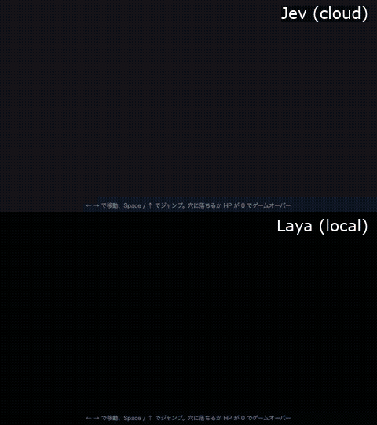
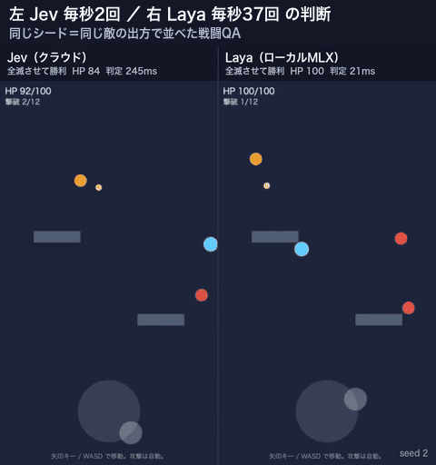

# game-qa

English | [日本語](README.ja.md)

A macOS app and CLI for letting fast decision models — [Jev](https://docs.typesafe.ai/introduction)
(cloud) and [Laya-MLX](https://github.com/mizorewww/laya-mlx) (on your Mac) — play your web game,
with scenarios you can pick and logs you can actually read.



game-qa starts your game, asks it what is going on, lets the model choose, and hands the choice
back to the game. It knows nothing about your game's input or rules; the game decides what the
choices are and how to perform them.

| Engine | Where it runs | One decision | Needs |
|---|---|---|---|
| Jev (TypeSafe AI) | cloud API | ~240 ms | `TYPESAFE_API_KEY` |
| Laya-MLX | your Mac (Apple Silicon GPU) | ~20 ms | nothing after the first model download |

In the example action game, Laya's 20+ decisions per second kept the player alive far better
than Jev's 2–3 (average damage over 60 s: 8 vs 23, same seeds).



## Quick start

### 1. Install

```sh
npm install
npx playwright install chromium

cp .env.example .env            # Jev: put TYPESAFE_API_KEY here (game-qa root, shared by all games)
bash laya/setup.sh              # Laya: Apple Silicon + uv
bash monitor-app/build_app.sh   # macOS monitor app → monitor-app/JevQAMonitor.app
```

### 2. Run the example

```sh
node bin/game-qa.cjs run --config examples/archer-arena/qa.config.json --scenario combat --provider laya --headed
```

Or open the monitor app, pick the project (`qa.config.json`), a scenario and Jev / Laya, and press
play. The browser opens on the right; every decision, its confidence and the game's state are
listed on the left.

### 3. The interface between game-qa and your game

This is the whole contract. Your game defines `window.__qa`:

```js
window.__qa = {
  configure(options) {},   // scenario options (time limits, where to stop, ...)
  observe() {              // called in a loop
    return {
      state:     { screen: 'Title' },                                        // context for the model
      questions: { tap: { type: 'choice', instructions: '...', criteria: { start: 'Start' } } },
      metrics:   { hp: 80 },                                                  // optional, for logs/reports
      done:      null,                                                        // or { success, reason } to finish
    };                                                                        // or null: nothing to decide now
  },
  act(answers) {           // answers.tap.choice === 'start'
    // perform it with your own input: dispatch events, drag a joystick, press keys ...
  },
};
```

game-qa passes `state` and `questions` to Jev / Laya unchanged and gives the answers to `act`.
Details and tips: [docs/protocol.md](docs/protocol.md).

### 4. Connect your own game with Claude Code

This repo ships a Claude Code skill that writes the adapter and project files for you:
[`.claude/skills/game-qa-integrate`](.claude/skills/game-qa-integrate/SKILL.md).

```sh
# make the skill available in your game's repo (or copy it to ~/.claude/skills/)
mkdir -p <your-game>/.claude/skills && cp -r .claude/skills/game-qa-integrate <your-game>/.claude/skills/
```

Then, in your game's repo, ask Claude Code: *"connect this game to game-qa"* (or run
`/game-qa-integrate`). It reads the game, adds `window.__qa`, creates `qa.config.json` and
scenarios, and verifies with a real run.

## Examples

| Example | Input | What the adapter does |
|---|---|---|
| [`examples/archer-arena`](examples/archer-arena) | menu taps + virtual joystick (mouse events) | 8-direction choices, directions that would get hit are left out |
| [`examples/side-runner`](examples/side-runner) | keyboard (← → Space) | run / jump choices, actions that end in a pit or an enemy are left out; looks further ahead when the model answers slowly |

In `side-runner`, Laya reaches the goal every run (~20 s, no damage); Jev at ~2 decisions per second
usually falls or runs out of HP around the middle of the stage.

## Project files

Everything specific to a game lives next to its `qa.config.json`:

```
my-game-qa/
  qa.config.json      how to start the app, hook name, default engine
  scenarios/*.json    what to test: time/step limits, setup steps, options passed to configure()
  danger-list.json    labels that must never be chosen (a safety net on top of the game's own filtering)
```

```json
{
  "name": "archer-arena",
  "app": { "serve": "./game", "port": 8124 },
  "scenarios": "./scenarios",
  "dangerList": "./danger-list.json",
  "provider": "jev"
}
```

`app` can also be `{ "command": "npm run dev", "url": "http://localhost:5173/" }` or
`{ "url": "https://staging.example.com/" }`. Runs write status, a live feed and full JSONL logs to
`<project>/.game-qa/`.

## Comparing engines

```sh
node bin/game-qa.cjs compare --config examples/archer-arena/qa.config.json --runs 5
node bin/game-qa.cjs report  examples/archer-arena/.game-qa/compare-<timestamp>
```

`compare` runs each scenario with the same seeds for every engine (it fixes `Math.random` before
the page loads) and records video. `report` builds side-by-side videos (needs `ffmpeg`) and an
HTML report.

## Articles (Japanese)

How this was built and what the comparison showed:

- [Building automated game QA with Jev](https://taku-game.com/entry/2026/09/22/204608)
- [Running the same QA on a Mac only with Laya-MLX](https://taku-game.com/entry/2026/09/22/204614)
- [Jev vs Laya on a real-time action game](https://taku-game.com/entry/2026/09/22/204622)

## License

MIT. See [LICENSE](LICENSE).

## Status

Early (v0.1). The monitor app UI is in Japanese for now. Issues and PRs are welcome.
